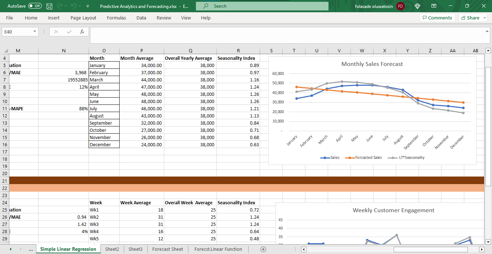
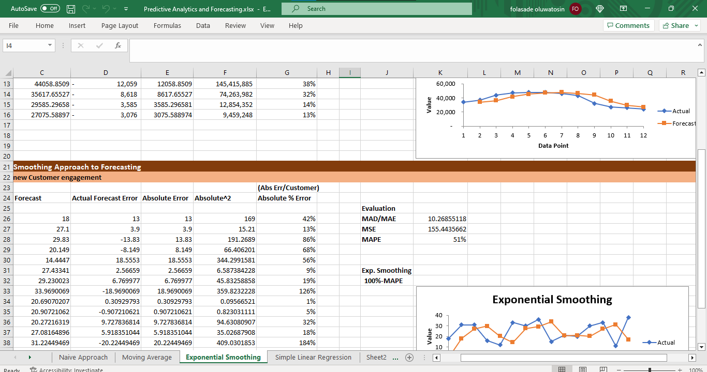
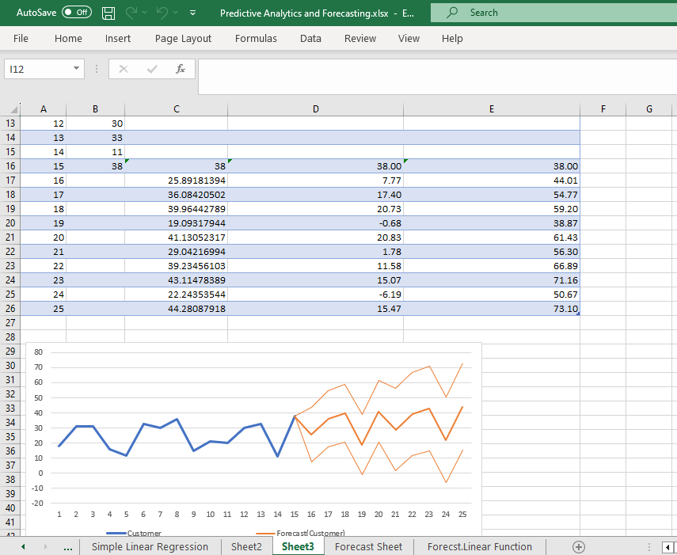

# Forecasting in Microsoft Excel
### Exploring forecast method to detect the most accurate forecast
#### Forcasting Types : Naive Approach, Moving Average, Exponential Smoothing, Simple Linear Regression and Forecast Linear Function

 
 

